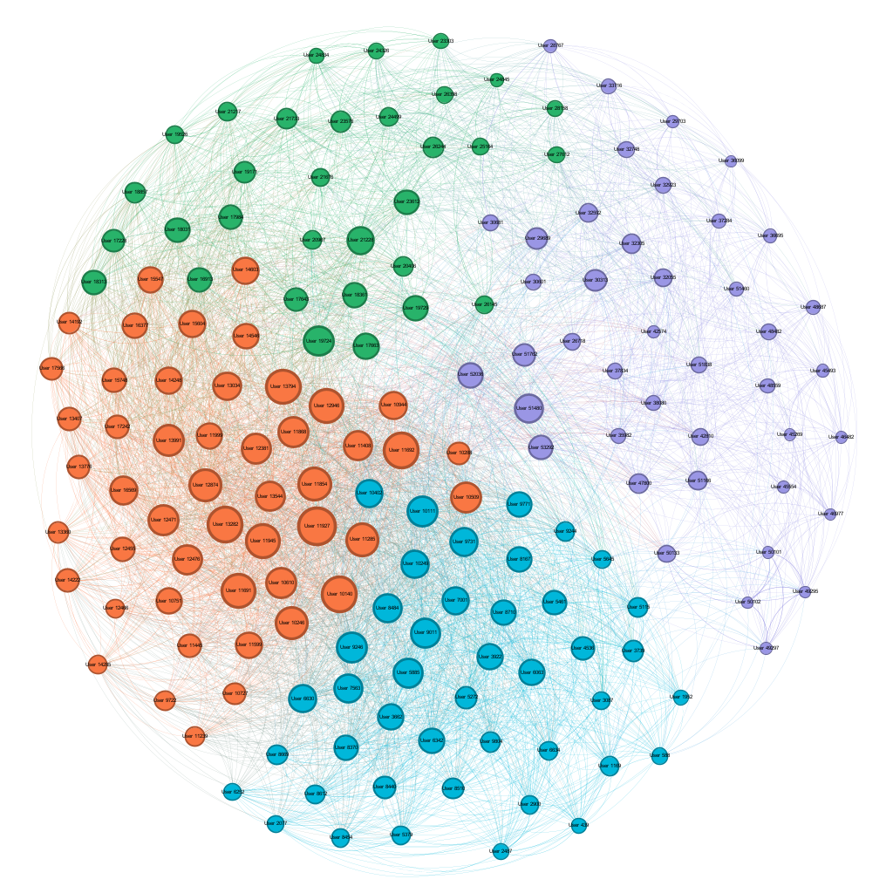
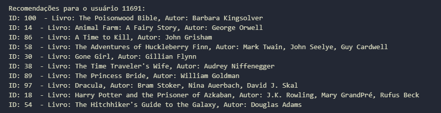

<h1 align="center" font-size="200em"><b> Sistema-De-Recomendacao-De-Livros </b></h1>

<div align = "center" >
<!-- imagem -->

[](https://code.visualstudio.com/docs/?dv=linux64_deb)


</div>

## 💻Objetivos
Este é um programa desenvolvido em Python para a disciplina de Algoritmos e Estruturas de Dados II, proposta pelo professor [Michel Pires](https://github.com/mpiress) <br>
O objetivo desta atividade consiste em identificar um problema específico que seja suscetível de modelagem por meio de um grafo.
Para esse trabalho foi escolhido o tema de recomendação de livros no qual é possivel realizar uma recomendação a um dado usuário usando algoritmos de grafo para isso.
Sendo assim ao final dessa atividade teremos um algoritmo que realiza as operações:
- [✔️] Criação de um grafo.
- [✔️] Recomendação a um dado usuário. 
- [✔️] Aplicação de algoritmos de grafos.


### Dependências

Antes de executar o código, é necessário ter as seguintes bibliotecas instaladas. Você pode instalá-las executando os seguintes comandos no terminal:

```bash
pip install pandas
pip install networkx
pip install matplotlib
pip install numpy
````

## 🧠Lógica adotada

  - Para a realização desse trabalho foi utilizado a ideia de colocar cada usuário como nó do grafo e ligar os usuários pela quantidade de livros que eles possuem em comum, sendo essa o peso das arestas. 
    - Para a realização disso, foi computado os dados de usuários que fizeram mais de 5 recomendações entretanto esse valor pode ser alterado indo na cédula 3 presente no arquivo `Main.ipynb` e alterar a variável: `qt_rating` para o numero desejado.
  -  Entao depois de realizado essas ligações é feito o cálculo da similaridade de Jaccard para cada conjunto de arestas presente no grafo, esse cálculo é feito pela interseção de livros lidos pelos pares de nós que se conectam pela aresta divido pela uniao dos livros lidos por ambos, esse valor resultante passa a ser o novo peso da aresta desse par de vértice.
  - Logo depois é realizada a execução da função `maximum_spanning_tree` da biblioteca NetworkX para gerar a árovre de abrngencia máxima.
  - Com essa árvore e a redução significativa do grafo é aplicado uma busca em largura (BFS) a partir do usuário que se deseja procurar no grafo.
  - Com isso é mostrado ao usuário a lista de livros que foram recomendados, essa lista pode ser limitada a uma quantidade de livros X, se caso deseja aumentar ou diminuir esse valor, na ultima cédula, basta mudar o valor da variável: `num_books_to_recommend` para o valor desejado. 


## RESULTADOS E ANÁLISE
Antes de procedermos com qualquer análise, é crucial ter em mente que os resultados dos testes podem variar consideravelmente dependendo das máquinas em que o programa é executado. Conforme a intuição sugere, máquinas mais poderosas tendem a produzir resultados superiores.
Os resultados mostrados nessa seção são retirados dos dataset que ja se encontram na pasta `DataFiles`.
Os resultados que se puderam extrair dessa atividade foi que o grafo gerado é um grafo esparso, com seu numero de arestas sendo inferior à $ |V^{2}|$.

Grafo de output gerado pelo aplicativo Gephi: 
<div align="center">
  
  <p align="center"><em> Grafo Gephi </em></p>
</div>

Lista de livros no output do usuário:
<div align="center">
  
  <p align="center"><em> Terminal com a lista de livros recomendada ao usuário de número 11691. </em></p>
</div>

## 📈 Conclusões:
Pode se concluir com essa atividade a versitilidade de grafos e suas aplicações diversar em varias areas, mesmo a área de recomendação tendo seus melhores resultados na utilização de tecnicas de machine learning, foi possivel criar um sistema de recomendação a partir de grafos eficiente e personalizado ao gosto de cada leitor presente no DataFrame.
Além disso com esse trabalho foi possível aprender novas tecnicas da aplicação de grafos e novos algoritmos tambem, foi possivel aprender diversos algoritmos de grafos e seus funcionamentos.

## 👾Compilação e execução

O codigo disponibilizado foi criado e executado em notebook Acer core i5 Aspire M com sistema operacional Windowns 10 e utlizado um terminal de execução do Jupyter Notebook.
Para a execução é necessario executar todas as cedulas do arquivo, ou uma cédula por vez.

## ✉️Contato
<div>
 <br><p align="justify"> Jullia Fernandes Felizardo</p>
 <a href="https://t.me/JulliaFernandes">
  
 </div>
<a style="color:black" href="mailto:julliacefet@gmail.com?subject=[GitHub]%20Source%20Dynamic%20Lists">
✉️ <i>julliacefet@gmail.com</i>
</a>


